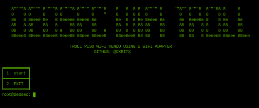

<h1 align="center"> DEDSEC WIFI TROLL </h1>
<h4 align="center"> It can disconnect wifi client and connect to your cloned ap and redirect users to rickroll page. </h4>

### INSTALLATION
* git clone https://github.com/0xbitx/Dedsec-Wifi-Troll.git
* cd Dedsec-Wifi-Troll
* chmod +x dedsec-wifitroll
* sudo ./dedsec-wifitroll

### TESTED ON FOLLOWING:
* Kali Linux
* Parrot OS
* Ubuntu

### PREREQUISITES
* sudo - [ MUST ]
* 2 wifi adapter support AP mode and monitor mode

### LANGUAGE 
* Python

<h1 align="center"> DISCLAIMER </h1>

<h4 align="center">I'm not responsible for anything you do with this program, so please only use it for good and educational purposes. </h4>
